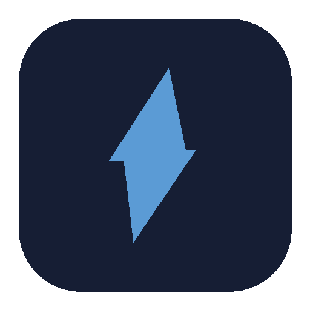

# KDNA QuickLaunch

A lightweight, cross-platform application launcher inspired by [Quicksilver](https://qsapp.com/) for Mac. Press a hotkey, type a few characters, and launch anything instantly. The app learns your personal abbreviations over time.



## Features

- **Adaptive Shortcuts** - Type 'ps' and select Photoshop once, and 'ps' will always show Photoshop first. The app learns *your* abbreviations.
- **Global Hotkey** - `Ctrl+Space` (Windows/Linux) or `Cmd+Space` (macOS) to show/hide instantly.
- **Fuzzy Search** - Find apps even with typos or partial names.
- **Calculator** - Type math expressions (`2+2`, `sqrt(144)`) and press Enter to copy the result.
- **Web Search** - Prefix with `?` to search the web (`?weather sydney`).
- **System Commands** - `lock`, `sleep`, `restart`, `shutdown`, `empty trash`.
- **Clipboard History** - Type `clip` to browse your last 50 clipboard entries.
- **File Search** - Search recent files and user-configured directories.
- **Dark & Light Themes** - Follows system preference by default, or set manually.
- **Cross-Platform** - Windows, macOS (Intel + Apple Silicon), and Linux.

## How the Adaptive Learning Works

Every time you type something and select a result, QuickLaunch records the association between your typed text and the item you chose:

1. Type `f` and select **Figma** - now `f` maps to Figma.
2. Next time you type `f`, Figma appears first immediately.
3. If you later type `f` and select **Firefox** several times, Firefox will eventually overtake Figma as the count grows.
4. `f` and `fi` track independently - each abbreviation has its own candidate list.

The ranking blends four signals:
- **Shortcut match** (60%) - Your trained abbreviation
- **Fuzzy match** (25%) - Name similarity via Fuse.js
- **Usage frequency** (10%) - How often you launch the item overall
- **Recency** (5%) - How recently you used it

On first launch with no learned data, the app falls back entirely to fuzzy search. No training step required.

## Install

### Windows
Download the latest `.exe` installer from [Releases](https://github.com/KrullDNA/App-Launcher/releases) or build from source.

### macOS
```bash
git clone https://github.com/KrullDNA/App-Launcher.git
cd App-Launcher
npm install
npm run package:mac
```
The `.dmg` will be in the `dist/` folder. Open and drag to Applications.

### Linux
```bash
git clone https://github.com/KrullDNA/App-Launcher.git
cd App-Launcher
npm install
npm run package:linux
```
The `.AppImage` and `.deb` will be in the `dist/` folder.

## Development

### Prerequisites
- Node.js 20+
- npm 9+

### Setup
```bash
git clone https://github.com/KrullDNA/App-Launcher.git
cd App-Launcher
npm install
```

### Run in development
```bash
npm run dev
```

### Type check
```bash
npm run typecheck
```

### Build for production
```bash
npm run build
```

### Package installer for current platform
```bash
npm run package
```

### Platform-specific packaging
```bash
npm run package:win    # Windows NSIS installer
npm run package:mac    # macOS DMG
npm run package:linux  # Linux AppImage + .deb
```

## Tech Stack

| Component | Technology |
|-----------|-----------|
| Framework | Electron |
| Frontend | React + TypeScript (strict mode) |
| Build | electron-vite |
| Styling | Tailwind CSS |
| State | Zustand |
| Search | Fuse.js |
| Calculator | mathjs |
| Storage | electron-store |
| Packaging | electron-builder |

## Project Structure

```
src/
  main/          # Electron main process
    main.ts        # Window management, hotkey, tray, IPC
    indexer.ts     # Cross-platform app + file indexing
    shortcuts-db.ts  # Adaptive learning database
    clipboard-manager.ts  # Clipboard history polling
  preload/       # contextBridge IPC bridge
    preload.ts
  renderer/      # React frontend
    App.tsx
    components/    # SearchBar, ResultItem, ResultsList
    hooks/         # useSearch, useKeyboardNav, useTheme
    stores/        # Zustand search store
    utils/         # Calculator, scoring algorithm
```

## License

MIT
